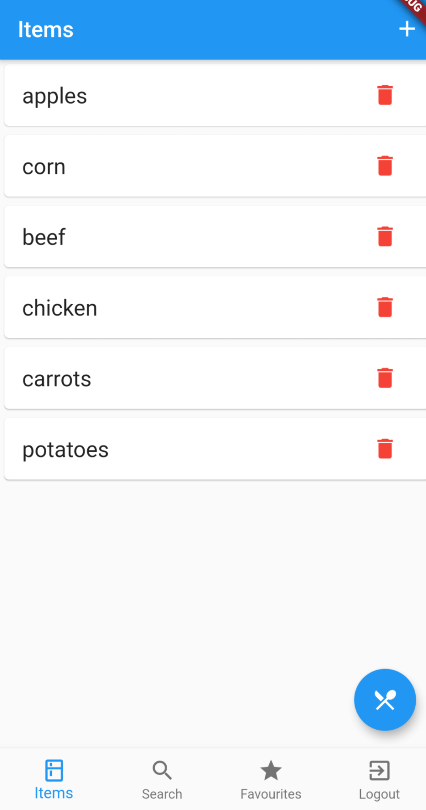
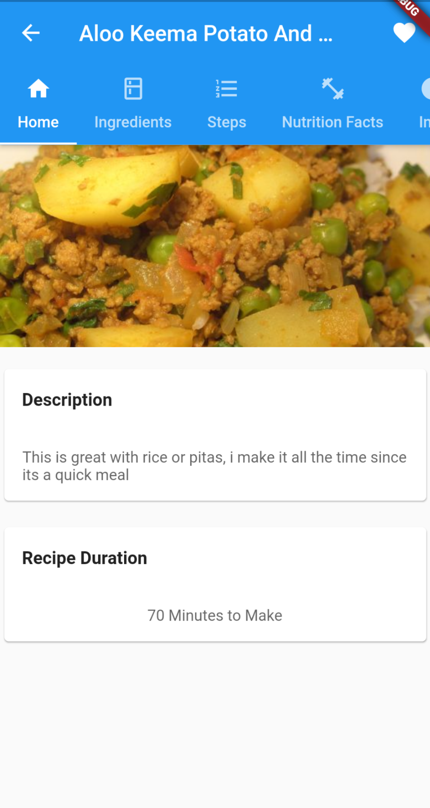

# Recipe Generator

Input items from your fridge and pantree to generate the best possible recipes for your current situation. All recipes were generated by food.com.  App is currently on the Google Play Store (https://play.google.com/store/apps/details?id=com.aadeel.recipe_app). 

## Commands

Run this command from the root to run the app.

```bash
flutter run
```
Run this command from the api folder to run and compile the backend.

```bash
yarn start
```

## Screenshots
 &nbsp;
 &nbsp;
 &nbsp;


## Tech Stack
* Flutter
* Dart
* GraphQL
* Firebase
* Python (Web Scraping)
* Node.js (14.4.0)
* MongoDB (Cloud Atlas)


## Contributing
Pull requests are welcome. For major changes, please open an issue first to discuss what you would like to change.
